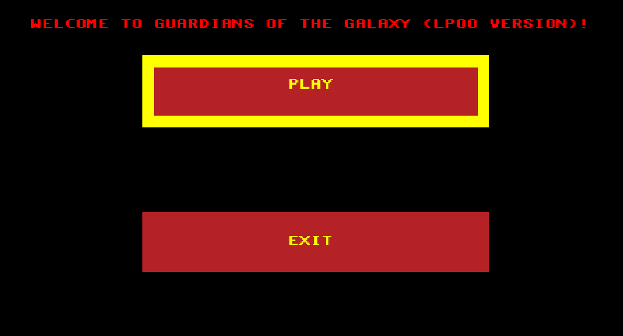
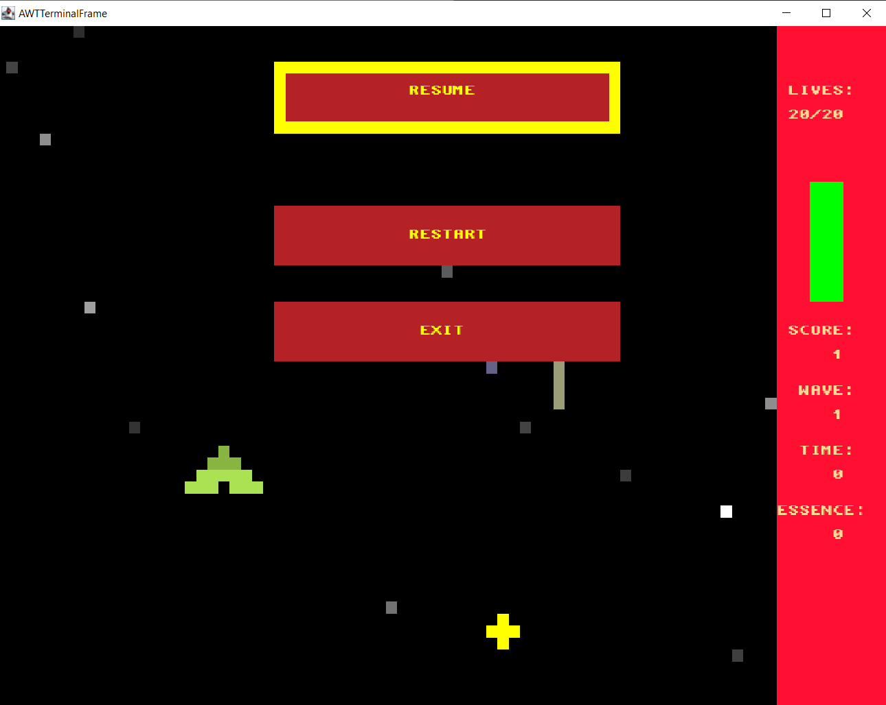
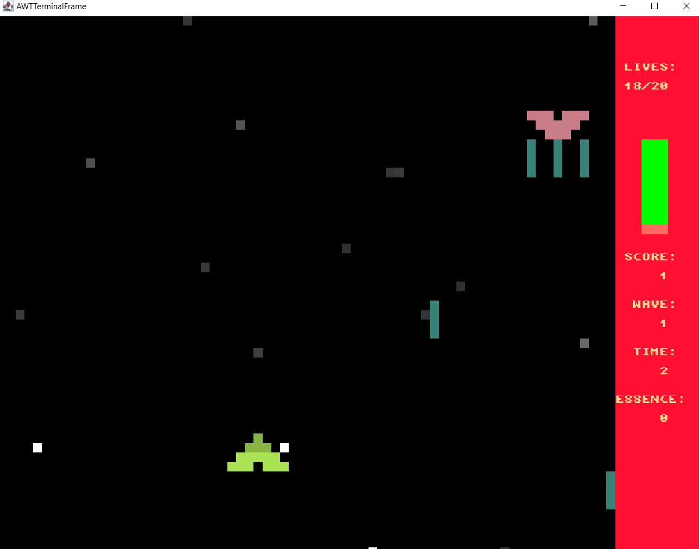

# LPOO_53 - Guardians of The Galaxy

Guardians of the galaxy tells the story of a lonely spaceship travelling through space, trying to survive.

It will have to fight strong enemies in order to collect golden treasures to go back to earth to help the planet restore its greatness.

The chosen spaceship proved itself to be worthy of this mission because of its magical abilities to restore the damage caused by the enemies and to place special shields that would protect them against all types of threats. These threats are not only the enemies, but also asteroids, which they need to pay careful attention since they destroy everything in a single hit.

# Screenshots from the game

*Example from the initial menu*

*This is what the game looks like when paused*

*Example from the game state*

