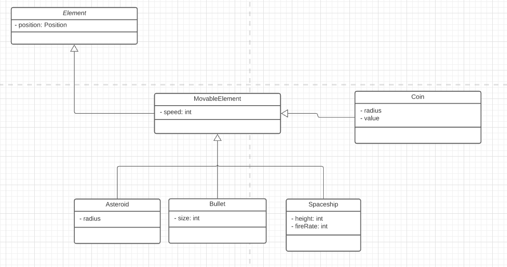
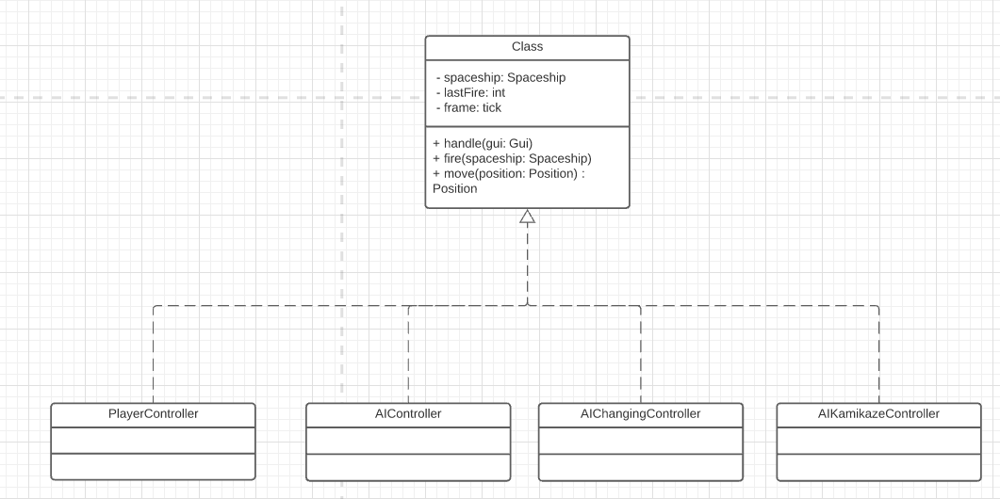

# LPOO_53 - Guardians of The Galaxy

## Planned Features

### Specific Elements

- Boss Enemies
- Powerup items
- Inventory
- Health bar
- Bullets indicator
- Score indicator
- Game menu:
  - Play
  - Scores
  - Configure player's look
### Controls and Actions
- Enemies' random generation
- Basic Powerups
- Combined Powerups
- Controlling powerups with mouse
- Asteroids actions
- Collectibles that improve player's score
- Apply collision detection to elements

## Implemented Features
### Elements and Views
- Player's Spaceship
- Enemies' Spaceship's
- Bullets
- Asteroids
- Coins

#### Example element views

#### UML Diagram

### Controls and actions
### Player's movement using keyboard, vertically and horizontally with some limits.

### Enemies' movement
|   |     |
| :---: | :---: |
|    |    |

### Shooting bullets

### Collision detection

## Game mockup

## Structure
#### Model view controller
- Model holds all the data for the game
- View is responsible to display the data stored in the model
- Controller is responsible to update the information in the model according to user interaction and game states

#### Rendering elements
- It is important that we build this part of the structure to be versatil, so that the game could be used with other engines.
- To allow this situation, we created an interface `gui` that has functions like `drawColor` or `drawCharacter`. These will be called by specific Viewers. Example:

## Design
### Spaceship Controllers
#### Problem in Context
Since we have only one class referring to the spaceships, either enemies or player, we needed to find a way to control this elements in different ways, so that it could be used by players and enemies.

In order to execute this we would probably have to use conditionals to decide what movements would be chosen.
This methodology would violate the single responsibility principle since the controller class would have to know how to control either players or enemies.

#### The pattern
To solve this issue, we have applied an adaptation of the [Strategy Pattern](https://refactoring.guru/design-patterns/strategy).
This pattern allows us to extract all the different controls into different classes, each strategy class containing methods only relevant to that specific controller.

#### Implementation
The current implementation is as follows in the UML diagram

This pattern is implemented in the following classes:
- [AIChangingController](https://github.com/FEUP-LPOO-2021/lpoo-2021-g53/blob/develop/src/main/java/com/shootemup/g53/controller/spaceship/AIChangingController.java)
- [AIShootingController](https://github.com/FEUP-LPOO-2021/lpoo-2021-g53/blob/develop/src/main/java/com/shootemup/g53/controller/spaceship/AIShootingController.java)
- [AIKamikazeController](https://github.com/FEUP-LPOO-2021/lpoo-2021-g53/blob/develop/src/main/java/com/shootemup/g53/controller/spaceship/AIKamikazeController.java)
- [PlayerController](https://github.com/FEUP-LPOO-2021/lpoo-2021-g53/blob/develop/src/main/java/com/shootemup/g53/controller/spaceship/PlayerController.java)

#### Preliminary analysis on Power ups

- State is the design pattern that will be the foundation to this set of features. According to what power up is being used, the player will have different states
- However, if powerups are used at the same time, we could adapt a Composite pattern to determine how the following actions would be applied. A function inside the composite class could mathematically calculate the powerup effects and its color.
