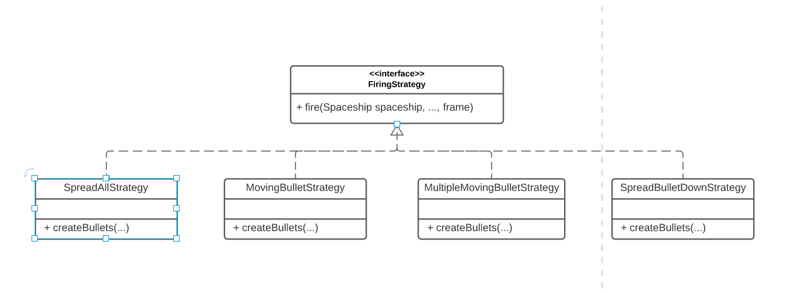
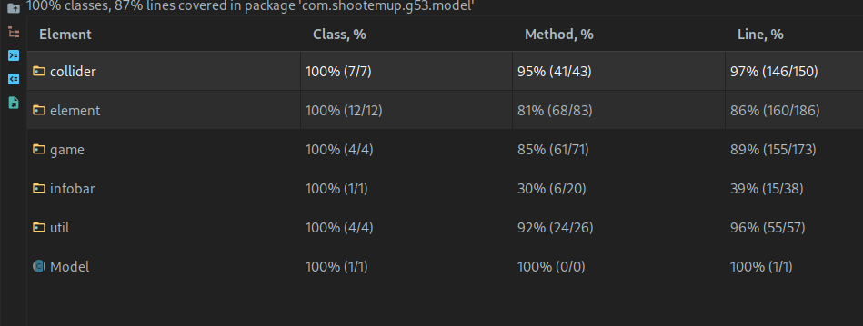

# LPOO_53 - Guardians of The Galaxy

Guardians of the galaxy tells the story of a lonely spaceship travelling through space, trying to survive.

It will have to fight strong enemies in order to collect golden treasures to go back to earth to help the planet restore its greatness.

The chosen spaceship proved itself to be worthy of this mission because of its magical abilities to restore the damage caused by the enemies and to place special shields that would protect them against all types of threats. These threats are not only the enemies, but also asteroids, which they need to pay careful attention since they destroy everything in a single hit.

## Instructions

- WASD - player movement
- E - use Shield PowerUp
- R - use Health PowerUp
- Arrow Keys - select menu options
- Space Keys - shoot bullets

## Planned Features

### Specific Elements

- Powerup items
- Inventory
- Bullets indicator
- Game menu:
  - Scores
  - Configure player's look

### Controls and Actions
- Combined Powerups
- Controlling powerups with mouse

## Implemented Features
### Elements and Views
- Player's Spaceship
- Enemies' Spaceship's
- Boss Enemies
- Bullets
- Asteroids
- Coins
- Information Bar
  - Health
  - Score
  - Essence
  - Time
- Essence
- Score indicator
- Menus:
  - Main Menu:
    - Play
    - Exit
  - Game Over Menu
    - Play
    - Exit
  - Pause Menu:
    - Restart
    - Resume
    - Exit

### Controls and Actions
- Wave generation of elements
- Health Boost Powerup
- Placeable shield Powerup
- Several Movement Strategies for enemies
- Several Firing strategies for enemies
- Collectibles that improve player's score
- Apply collision detection to elements

#### Example element views

#### UML Diagram

### Controls and actions
### Player's movement using keyboard, vertically and horizontally with some limits.

### Enemies' movement
|   |     |
| :---: | :---: |
|    |    |

### Shooting bullets

### Collision detection

## Game mockup

## Structure
#### Model view controller
- Model holds all the data for the game
- View is responsible to display the data stored in the model
- Controller is responsible to update the information in the model according to user interaction and game states

#### Rendering elements
- It is important that we build this part of the structure to be versatile, so that the game could be used with other engines.
- To allow this situation, we created an interface `gui` that has functions like `drawColor` or `drawCharacter`. These will be called by specific Viewers. Example:

## Design

### Gui

### Problem in Context
We need to have an organized codebase related to views and inputs, so that the game works with different libraries besides [Lanterna](https://mvnrepository.com/artifact/com.googlecode.lanterna/lanterna/3.0.1).

#### The pattern
In order to solve this problem we chose the [Facade Pattern](https://refactoring.guru/design-patterns/facade). This helps us create a good level of abstraction to the library.

#### Implementation

To implement this we also created an AWTInputController in order to get a fluid movement to the player, that the pollInput method wouldn't be able to replicate, creating a map of active actions.

The following UML illustrates how this pattern was implemented:

#### Consequences

This allows us to have a clean way of accessing input data and drawing to the screen. It also allows the project to use different gui libraries.

### Player States

#### Problem in Context

As with most Shoot Em Up games, upon any type of collision the player does, there's usually a grace period during which the player can't be hit. We also wanted to implement this behaviour.

#### The pattern

In order to do this, we decided to adopt a State Pattern since we wanted a different firing and colliding behaviour depending on which state the player is : InvincibleState or NormalState. This kind of approach also allows for easy expansion since adding a new State only requires creating a new State subclass and overriding the base Player behaviour.

#### Implementation

The following UML illustrates how this pattern was implemented:

The following State Diagram represents when the different states will transition between each other:

#### Consequences

The application of this pattern removed the need to use conditionals to check if the player can or cannot take damage from spaceships.

### Game States

#### Problem in Context

We used this pattern MVC-style to create the various states of the game (Menu, Playing, GameOver...) . What we needed was an elegant way of switching between the different stages that would allow us enough flexibility to add or remove a new stage as the development of the game progressed.

##### The pattern

To implement the different states of the game we used the state pattern, which would allows us to represent different states with different subclasses. We can switch to a different state of the application by switching to another implementation (i.e., another subclass) .

#### Implementation

The following UML illustrates how this pattern was implemented:

These classes can be found here:

- [Game](../src/main/java/com/shootemup/g53/controller/Game.java)
- [State](../src/main/java/com/shootemup/g53/controller/state/State.java)
- [PlayState](../src/main/java/com/shootemup/g53/controller/state/PlayState.java)
- [PauseState](../src/main/java/com/shootemup/g53/controller/state/PauseState.java)
- [MenuState](../src/main/java/com/shootemup/g53/controller/state/MenuState.java)
- [GameOverState](../src/main/java/com/shootemup/g53/controller/state/GameOverState.java)

#### Consequences

This pattern not only respects the Open - Closed Principle but also allows to easily add more stages to a game or quickly change the implementation of one state. Because each state is in the MVC Architectural Pattern, the flexibility is even higher allowing us to change the View of any state should we not be happy with it.

### Menus
#### Problem in Context

When implementing the Menu, we found ourselves in a situation where the PauseController and MenuControllers had to interact with the buttons in the Model and somehow change the Game state. However, neither the Models nor the View Controllers should know how to handle Game states.

#### The pattern
To solve this issue, we have applied an adaptation of the [Command Pattern](https://refactoring.guru/design-patterns/command), encapsulating the Game state changes in the Buttons themselves.

This pattern allows us to extract all the different commands into different classes, so that adding a new command is as simple as adding a new Command class.

#### Implementation
This pattern was conceived by creating an abstract class ButtonCommand that receives a Game instance and operates on it. This class has a method execute that is implemented by each concrete ButtonCommand and is called to perform the defined operation.

This pattern is implemented in the following classes:

- [ButtonCommand](../src/main/java/com/shootemup/g53/controller/command/ButtonCommand.java)
- [ExitCommand](../src/main/java/com/shootemup/g53/controller/command/ExitCommand.java)
- [MenuCommand](../src/main/java/com/shootemup/g53/controller/command/MenuCommand.java)
- [ResumeCommand](../src/main/java/com/shootemup/g53/controller/command/ResumeCommand.java)
- [StartCommand](../src/main/java/com/shootemup/g53/controller/command/StartCommand.java)
- [Game](../src/main/java/com/shootemup/g53/controller/Game.java)

#### Consequences

We were able to define 4 commands, Start, Restart, Exit and Menu. These change the Game State accordingly, without having to know how they are implemented and what they do. If we later wanted to access these commands through keyboard shortcuts it would be very easy to do so.

### Observer Patterns for everyone
#### Problem in Context

When implementing the InfoBar, we found ourselves needing information from many classes from all over our program. It needed to know when the player lost health, when the player gained score, when the waveController spawned a new Wave, etc. Adding to this, we were having to needlessly draw the menus every frame like we did with the Play State even though it only needed to be redrawn when there was a user input.

#### The pattern
To solve this issue, we have applied an adaptation of the [Observer Pattern](https://refactoring.guru/design-patterns/observer).

#### Implementation
The current implementation when dealing with notifying the event of player taking damage.

The above UML contains the following classes.

- [EventSubject](../src/main/java/com/shootemup/g53/controller/observer/EventSubject.java)
- [LifeController](../src/main/java/com/shootemup/g53/controller/observer/LifeController.java)
- [PlayerController](../src/main/java/com/shootemup/g53/controller/player/PlayerController.java)
- [PlayerLifeObserver](../src/main/java/com/shootemup/g53/controller/observer/PlayerLifeObserver.java)
- [InfoBarModel](../src/main/java/com/shootemup/g53/model/infobar/InfoBarModel.java)

The current implementation when dealing with notifying the event of the waveController spawning a new wave.

The above UML contains the following classes.

- [EventSubject](../src/main/java/com/shootemup/g53/controller/observer/EventSubject.java)
- [WaveCompletionController](../src/main/java/com/shootemup/g53/controller/observer/WaveCompletionController.java)
- [WaveController](../src/main/java/com/shootemup/g53/controller/player/PlayerController.java)
- [WaveCompletionObserver](../src/main/java/com/shootemup/g53/controller/observer/WaveCompletionObserver.java)
- [InfoBarModel](../src/main/java/com/shootemup/g53/model/infobar/InfoBarModel.java)

The above UML contains the following classes.

- [EventSubject](../src/main/java/com/shootemup/g53/controller/observer/EventSubject.java)
- [InputNotifier](../src/main/java/com/shootemup/g53/controller/input/InputNotifier.java)
- [InputObserver](../src/main/java/com/shootemup/g53/controller/input/InputObserver.java)
- [PauseStateController](../src/main/java/com/shootemup/g53/controller/game/PauseStateController.java)

#### Consequences
This pattern allows all the different classes which the InfoBar needs information from to notify the infoBar when certain changes happen. It would also allow for the Gui to notify the PauseStateController, GameOverController and MenuStateController when there is a new input, so they can redraw accordingly.

### Game Controller and Model initialization
#### Problem in Context

When the game starts, a game model and a game controller are created. This became problematic when the game started becoming more complex, requiring to create objects and storing them in the game model and then storing their controllers in the game controller. We could also want to create a gameModel or gameController without a background, or a gameModel and Controller with two or more players. This could be done in the client, but it would result in messy and confusing code.

#### The pattern

To solve this issue, the [Builder Pattern](https://refactoring.guru/design-patterns/builder) was applied.

The pattern is used to facilitate the creation of different types of game models and controllers.

#### Implementation

We created a builder for the game controller and a builder for the game model. To ensure that the correct order of operations was used, a Director was created that directs both builder objects passed by parameter to its constructor.

The current implementation is as follows in the UML diagram.

This pattern is implemented in the following classes:

- [GameDirector](../src/main/java/com/shootemup/g53/controller/gamebuilder/GameDirector.java)
- [GameModelBuilder](../src/main/java/com/shootemup/g53/controller/gamebuilder/GameModelBuilder.java)
- [GameControllerBuilder](../src/main/java/com/shootemup/g53/controller/gamebuilder/GameControllerBuilder.java)

#### Consequences

Using the builder pattern we can build the game controller and game model step-by-step or even skip some steps, allowing for an easy way to create different types of controllers and models, like a game model without a background or with more players.

### Firing
#### Problem in Context
We wanted to create different ways of firing that could be applied to the spaceships.

We also didn't want to create lots of duplicated or hard to maintain code. The solution needed to allow
the easy creation of different firing methods without causing divergent changes or shotgun surgery.

#### The pattern
To solve this issue, we have applied an adaptation of the [Strategy Pattern](https://refactoring.guru/design-patterns/strategy).
This pattern allows us to extract all the different controls into different classes, each strategy class containing methods only relevant to that specific controller.

#### Implementation
The current implementation is as follows in the UML diagram

This pattern is implemented in the following classes:

- [FiringStrategy](../src/main/java/com/shootemup/g53/controller/firing/FiringStrategy.java)
- [MovingBulletStrategy](../src/main/java/com/shootemup/g53/controller/firing/MovingBulletStrategy.java)
- [MultipleMovingBulletStrategy](../src/main/java/com/shootemup/g53/controller/firing/MultipleMovingBulletStrategy.java)
- [SpreadAllStrategy](../src/main/java/com/shootemup/g53/controller/firing/SpreadAllStrategy.java)
- [SpreadBulletDownStrategy](../src/main/java/com/shootemup/g53/controller/firing/SpreadBulletDownStrategy.java)
- [SpreadBulletUpStrategy](../src/main/java/com/shootemup/g53/controller/firing/SpreadBulletUpStrategy.java)

#### Consequences

Using a strategy pattern we can change firing patterns during the code's runtime. It also makes it easy to set a pattern randomly to an enemy spaceship and to create new patterns. It also allows us to separate the code of the spaceship controllers from the firing algorithms.

### Movement

#### Problem in Context

We wanted to create different ways of movement that could be applied to various elements like
asteroids, spaceships or bullets.

We also didn't want to create lots of duplicated or hard to maintain code. The solution needed to allow
the easy creation of different movement methods without causing divergent changes or shotgun surgery.

#### The Pattern

To solve this issue, we have applied a [Strategy Pattern](https://refactoring.guru/design-patterns/strategy).

#### Implementation

The current implementation is as follows in the UML diagram.

This pattern is implemented in the following classes:

- [MovementStrategy](../src/main/java/com/shootemup/g53/controller/movement/MovementStrategy.java)
- [ChangingMovement](../src/main/java/com/shootemup/g53/controller/movement/ChangingMovement.java)
- [CompositeMovement](../src/main/java/com/shootemup/g53/controller/movement/CompositeMovement.java)
- [IncrementalMovement](../src/main/java/com/shootemup/g53/controller/movement/IncrementalMovement.java)
- [LeftMovement](../src/main/java/com/shootemup/g53/controller/movement/LeftMovment.java)
- [RightMovement](../src/main/java/com/shootemup/g53/controller/movement/RightMovement.java)
- [CircularMovement](../src/main/java/com/shootemup/g53/controller/movement/CircularMovement.java)
- [DiagonalBounceMovement](../src/main/java/com/shootemup/g53/controller/movement/DiagonalBounceMovement.java)
- [DiagonalDownLeftMovement](../src/main/java/com/shootemup/g53/controller/movement/DiagonalDownLeftMovement.java)
- [DiagonalDownRightMovement](../src/main/java/com/shootemup/g53/controller/movement/DiagonalDownRightMovement.java)
- [FallDownMovement](../src/main/java/com/shootemup/g53/controller/movement/FallDownMovement.java)
- [MoveUpwardsMovement](../src/main/java/com/shootemup/g53/controller/movement/MoveUpwardsMovement.java)

#### Consequences

Using a strategy pattern we can change movement patterns during the code's runtime. It also makes it easy to set a pattern randomly to an enemy spaceship and to create new patterns. It also allows us to separate the code of the spaceship controllers from the movement algorithms.

### Colliders

#### Problem in Context

Elements like asteroids and bullets need to collide with spaceships, so we can know when to
remove health from them. To do this elements need to have associated colliders that have different shapes
to create more believable collisions.

Different shapes have different ways of checking collision with each other which, if not correctly
designed, could degenerate into multiple switch statements.

The idea is to have multiple lines per collider with different widths and relative positions and
have collision checking using polymorphism.

#### The Pattern

To solve the issue related to the checking of collisions of different shapes, while keeping the benefits of polymorphism
, a variation of the [Visitor Pattern](https://refactoring.guru/design-patterns/visitor) was used. We deviated from
the standard visitor behaviour by making the collider visit the other collider (a self visitor), making the collider
both the visitor and also the visited element. One disadvantage of this pattern is that
whenever we need to create a new collider shape, the Collider class needs to be changed.

#### Implementation

The current implementation is as follows in the UML diagram.

This pattern is implemented in the following classes:

- [BodyCollider](../src/main/java/com/shootemup/g53/model/collider/BodyCollider.java)
- [LineCollider](../src/main/java/com/shootemup/g53/model/collider/LineCollider.java)
- [LineCompositeCollider](../src/main/java/com/shootemup/g53/model/collider/LineCompositeCollider.java)

#### Consequences

The visitor pattern allows to easily create interactions with different types of colliders. However, whenever a new collider is created, a new method in the BodyCollider class has to be created, and every subclass has to implement it.

### Collision Handlers

#### Problem in Context

Each object needs to have a different way of handling collisions with other objects. For example, when the player collides with a coin
it needs to add it to its coin counter, and the coin needs to deactivate itself. An [Observer Pattern](https://refactoring.guru/design-patterns/observer)
could have been used, that would execute an action whenever a collision occurred, but it required some complicated set up, and the use of checking of class types.

#### The Pattern

To solve this issue, the [Visitor Pattern](https://refactoring.guru/design-patterns/visitor) was used. A CollisionHandler interface was created
that described the interactions needed to be overriden by each controller.

#### Implementation

The current implementation is as follows in the UML diagram.

This pattern is implemented in the following classes:

- [CollisionHandlerController](../src/main/java/com/shootemup/g53/controller/element/CollisionHandlerController.java)
- [AsteroidController](../src/main/java/com/shootemup/g53/controller/element/AsteroidController.java)
- [BulletController](../src/main/java/com/shootemup/g53/controller/element/BulletController.java)
- [CoinController](../src/main/java/com/shootemup/g53/controller/element/CoinController.java)
- [EssenceController](../src/main/java/com/shootemup/g53/controller/element/EssenceController.java)
- [ShieldController](../src/main/java/com/shootemup/g53/controller/element/ShieldController.java)
- [SpaceshipController](../src/main/java/com/shootemup/g53/controller/element/SpaceshipController.java)
- [PlayerController](../src/main/java/com/shootemup/g53/controller/player/PlayerController.java)

#### Consequences

Using this pattern, it is easy to define what each controller should do whenever a collision occurs between the object it controls with another object.
The pattern also allows the usage of the fields of the colliding object in a simple manner.

However, whenever a new collidable object is added, the CollisionHandlerController interface must be updated to reflect the new object and each controller needs to describe what it does whenever it collides with this new object.

### Bounding Box Creation

#### Problem in Context

Each collider shape has a different way of calculating and creating their bounding boxes. However, this shouldn't be
the colliders' function, as it would violate the Single-Responsibility principle.

#### The Pattern

To solve this issue, the [Factory Pattern](https://refactoring.guru/design-patterns/factory-method) was used.
The factory creates a bounding box based by the type of the object passed through the parameter.

#### Implementation

The current implementation is as follows in the UML diagram.

This pattern is implemented in the following class:

- [BoundingBoxFactory](../src/main/java/com/shootemup/g53/model/collider/BoundingBoxFactory.java)

#### Consequences

The use of the Factory Pattern helps to keep classes simple and separate their functions. The Line Collider does not need to know how to create its bounding box. The Factory also makes it easier to create different types of Bounding boxes.

### Line Composite Collider Shapes

#### Problem in Context

Every time we want to create a Line Composite Collider, a list of Line Colliders must be passed by parameter through
the constructor. This can become quite messy and complicated, with a lot of duplicated code, specially since most of the
elements are represented by shapes like triangles, vertical lines or diamonds.

#### The Pattern

To solve this issue, the [Factory Pattern](https://refactoring.guru/design-patterns/factory-method) was used.

#### Implementation

The current implementation is as follows in the UML diagram.

This pattern is implemented in the following class:

- [LineCompositeFactory](../src/main/java/com/shootemup/g53/model/collider/LineCompositeFactory.java)

#### Consequences

The solution makes it easy to create different shapes using Line Composite Colliders. To add a new shape, it is only needed to create a new method. It also helps to make the client code easier to understand as it removes the need to create the Line Colliders manually every time, reducing duplicate code.

### Bullets
#### Problem in Context
Since we have to spawn a lot of bullets during the game, we might have to be calling `new` a lot of times to instantiate those objects, which can be a little exhaustive and time-consuming.

#### The Pattern
To solve this issue, we implemented a cache of Bullet objects, following the [Object pool](https://gameprogrammingpatterns.com/object-pool.html) optimization pattern. We adapted this pattern to create the objects on startup, and then we can request them and manipulate their data, which is faster than instantiating a new object. If the pool has no available object, it returns a null so that we can handle the situation according to our desire.

#### Implementation

The current implementation is as follows in the UML diagram.

This pattern is implemented in the following classes:
- [ObjectPool](../src/main/java/com/shootemup/g53/model/util/objectpool/ObjectPool.java)
- [BulletPoolController](../src/main/java/com/shootemup/g53/controller/game/BulletPoolController.java)
- [GameModel](../src/main/java/com/shootemup/g53/model/collider/LineCompositeFactory.java)
- [PoolableObject](../src/main/java/com/shootemup/g53/model/util/objectpool/PoolableObject.java)
- [Bullet](../src/main/java/com/shootemup/g53/model/element/Bullet.java)

#### Consequences
The pattern used allows spawning bullets very quickly and more efficiently and with easy access, controlling the game data in a very organized and structured way.

### Wave generation of Elements
#### Problem in Context
In order to have an interesting and challeging game, we need to instantiate new elements in the scene, and in augmenting dificulty. To achieve this we chose to implement a wave type of game, where the more waves the player defeats, the harder it is to survive.

There are two different types of waves: normal enemies and boss enemies. Each waves' spaceships differ in terms of health, size, damage and other properties, so we need a way to randomly parametrize these values with some limits and variations.

#### The Pattern
To solve this issue we used the [Factory Pattern](https://refactoring.guru/design-patterns/factory-method). This factory parametrizes the spaceship generator and chooses when to set up the next wave.

#### Implementation

The current implementation is as follows in the UML diagram.

This pattern is implemented in the following classes:
- [Wave](../src/main/java/com/shootemup/g53/controller/gamebuilder/Wave.java)
- [Wave Factory](../src/main/java/com/shootemup/g53/controller/gamebuilder/WaveFactory.java)
- [Asteroid Generator](../src/main/java/com/shootemup/g53/controller/gamebuilder/element/AsteroidGenerator.java)
- [Coin Generator](../src/main/java/com/shootemup/g53/controller/gamebuilder/element/CoinGenerator.java)
- [Element Generator](../src/main/java/com/shootemup/g53/controller/gamebuilder/element/ElementGenerator.java)
- [Essence Generator](../src/main/java/com/shootemup/g53/controller/gamebuilder/element/EssenceGenerator.java)
- [Movable Generator](../src/main/java/com/shootemup/g53/controller/gamebuilder/element/MovableElementGenerator.java)
- [Spaceship Generator](../src/main/java/com/shootemup/g53/controller/gamebuilder/element/SpaceshipGenerator.java)

#### Consequences
The pattern allows us to easily spawn different types of waves because it's easy to parametrize new spaceships to the next wave, allowing increasing damage, health and other properties of the enemies.

### Generating Spaceships fire and movement Strategies
#### Problem in Context
In order to apply to the enemies' spaceships several strategies implemented and discussed previously in this report, we had to find a way to randomly choose firing and movement strategies.

#### The Pattern
To solve this issue we used the [Factory Pattern](https://refactoring.guru/design-patterns/factory-method). This factory randomly chooses and instantiates several strategies. This is applied similarly both to Firing Strategies and MovementStrategies

#### Implementation

The current implementation is as follows in the UML diagram.

This pattern is implemented in the following classes:
- [Movement Factory](../src/main/java/com/shootemup/g53/controller/gamebuilder/MovementStrategyFactory.java)
- [Firing Factory](../src/main/java/com/shootemup/g53/controller/gamebuilder/FiringStrategyFactory.java)

#### Consequences
The pattern allows us to easily create several spaceships with variations.
The factory allows choosing from which strategies to choose from, by sending an array of strategy types.

By using these factories and wave generations, the game can evolve to very different states and very different enemies.

## Known Code Smells and Refactoring Suggestions

### Duplicate code

The classes [GameOverController](../src/main/java/com/shootemup/g53/controller/game/GameOverController.java), [MenuStateController](../src/main/java/com/shootemup/g53/controller/game/MenuStateController.java) and [PauseStateController](../src/main/java/com/shootemup/g53/controller/game/PauseStateController.java) all share the same code for their handleKeyPress() method since they all must implement the same basic Menu functionalities of selecting options. One solution to this would be to perform an Extract Method for all classes, followed by a Pull Up Field to a GeneralMenu class, for example.

### Primitive obessession

In our current version of the code, the color of the many Elements is being represented as a String which would be better off being represented as a Color class seeing as there's some behaviour associated with it, expressed in the [ColorOperation](../src/main/java/com/shootemup/g53/model/util/ColorOperation.java) class.

### Long class

The class [GameController](../src/main/java/com/shootemup/g53/controller/game/GameController.java) is doing too many operations.

### Switch Statement
The [DiagonalBounceMovement](../src/main/java/com/shootemup/g53/controller/movement/CircularMovement.java) contains switch case statements.

We can solve this issue by replacing the `Direction` with a state class, using a State Pattern. This could be achieved by using the already implemented [DiagonalDownLeft](../src/main/java/com/shootemup/g53/controller/movement/DiagonalDownLeftMovement.java) and [DiagonalDownRight](../src/main/java/com/shootemup/g53/controller/movement/DiagonalDownRightMovement.java) movement classes.

### Shotgun Surgery

Whenever a new collider shape is added, a new abstract method for checking collision with it has to be added to the
[BodyCollider](../src/main/java/com/shootemup/g53/model/collider/BodyCollider.java) class, which means every sub-class of BodyCollider needs to implement that method. The same reasoning applies for the collision handlers.

There is no way to solve this issue without removing the Visitor Pattern which would make for worse organization.

### Long Parameter List

The classes [AsteroidGenerator](../src/main/java/com/shootemup/g53/controller/gamebuilder/element/AsteroidGenerator.java), [CoinGenerator](../src/main/java/com/shootemup/g53/controller/gamebuilder/element/CoinGenerator.java), [ElementGenerator](../src/main/java/com/shootemup/g53/controller/gamebuilder/element/ElementGenerator.java), [EssenceGenerator](../src/main/java/com/shootemup/g53/controller/gamebuilder/element/EssenceGenerator.java), [MovableElementGenerator](../src/main/java/com/shootemup/g53/controller/gamebuilder/element/MovableElementGenerator.java) and [SpaceshipGenerator](../src/main/java/com/shootemup/g53/controller/gamebuilder/element/SpaceshipGenerator.java) have long parameter lists in their constructors.

This could be fixed using a parameter object, since lots of parameters are shared across these classes. Another solution would be to apply a [Builder Pattern](https://refactoring.guru/design-patterns/builder) and set the paramters through setters, but this only changes how the parameters are set, making for a vertically larger code, instead of horizontally large.

## Testing
### Mutation
[Mutation testing](tests/pitest/index.html)

### Coverage

Some features that are already well-defined strong tests, however there are some mutants still left to fix.

Some situations like game states and controllers are yet tested, since they are still in a thought process.

### Conclusion

Due to lack of time to test everything, we focused harder on testing the controllers and left some models fairly untested - also because the model usually has only setters and getters.
However, we tried very hard to eliminate mutations in the tests, and we accomplished a very good result. The mutants left in the code are some basic `Thread.sleep`  which we didn't find a way of testing, and some boundaries issues.

## Self-evaluation

- Andre Moreira - 33.33%
- Miguel Freitas - 33.33%
- Nuno Alves - 33.33%
